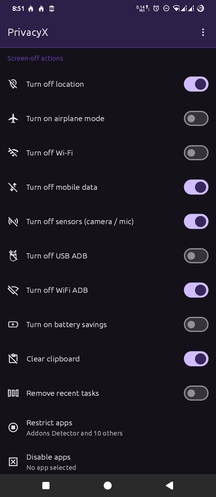
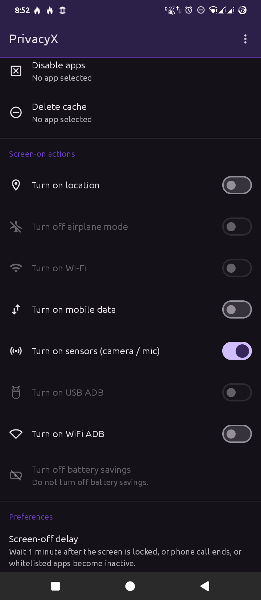
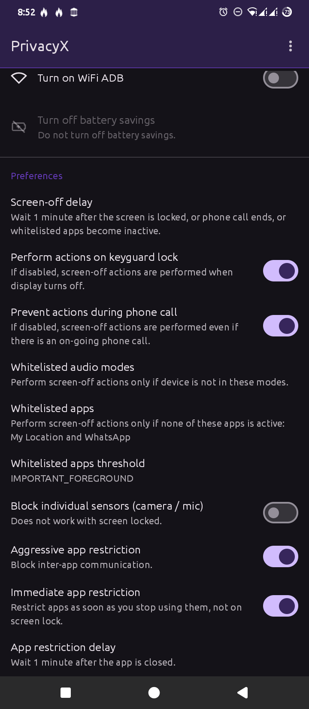
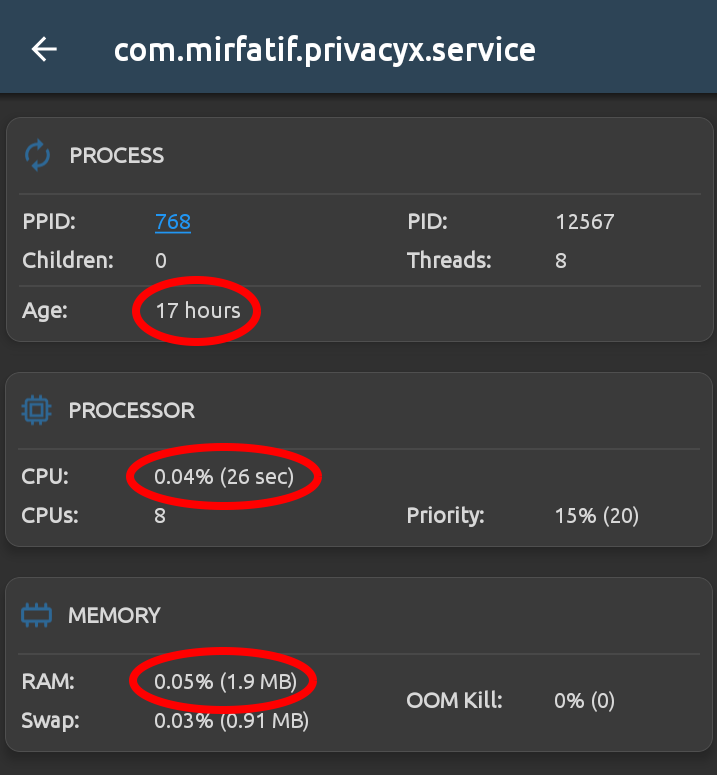

# PrivacyX
Privacy eXtreme gives you fine-grained control over what your device and installed apps do when you are not using them, with a focus on privacy, security, and automation.

PrivacyX complements our other privacy-focused apps:

- [WhatsRunning](https://github.com/mirfatif/WhatsRunning) monitors [what keeps running in the background](https://mirfatif.github.io/IAnswers/view_android_background_apps).
- [Fyrypt](https://github.com/mirfatif/Fyrypt) monitors [what keeps connecting to the internet](https://mirfatif.github.io/IAnswers/android_monitor_apps_internet_connection).

**Download:**

 

👉 **Attention:** PrivacyX works only with $${\color{red}\textbf{ROOT}}$$.

**What you can automate with PrivacyX:**

- Turn off/on location
- Turn on/off airplane mode
- Turn off/on Wi-Fi
- Turn off/on mobile data
- Turn off/on sensors (camera / mic)
- Turn off/on USB ADB
- Turn off/on Wi-Fi ADB
- Turn on/off battery savings
- Clear clipboard
- Remove recent tasks
- Restrict apps
- Disable app
- Delete cache

**App restriction** can also be applied as soon as you stop using apps, instead of waiting for screen lock or screen-off.

## Screenshots

  

## Limitations of PrivacyX
- Requires root.
- Runs only in the primary user account / owner profile.
- Works on Android 10-16 only (will try to keep it working on new Android releases).
- No localization, so far (but planned).
- More?

## More

**Is PrivacyX open-source?**

No.

**Is PrivacyX completely free of cost?**

No.

**Does PrivacyX collect my data?**

No. Never. Not even a single byte.

**Does PrivacyX show ads?**

No. Ad bombardment exploits psychological and emotional vulnerabilities of humans. Consumerism is evil. It's unfair. We don't do that. But yes. Some real good resources on internet run on ads. We should support them.

**Can PrivacyX harm my device?**

Despite having root privileges, PrivacyX does not make any persistent changes to your device. No files are created outside the app directories, except the IFW file (if "Aggressive app restriction" is enabled). No system components are touched in an irreversible manner. Ungrant root access, and uninstall the app. Even if something goes unexpected, do a device reboot. And all is clean.

**Why PrivacyX connects to ...?**

- `mirfatif.com`: It's home. But PrivacyX doesn't call home when it's with you. Rest assured. Occasional license checks happen with the bare minimum non-personal information sent to our tiny server (details [here](https://mirfatif.github.io/mirfatif/getpro#tnc)). App connects to the same domain when you send a crash report. What's being sent is visible to you on the screen.
- `api.github.com`: To check for app updates.

You can use [Fyrypt](https://github.com/mirfatif/Fyrypt) to monitor when and where apps connect.

**How much resources PrivacyX uses?**

Negligible. Only the root helper runs in the background. You can use [WhatsRunning](https://github.com/mirfatif/WhatsRunning) to monitor apps' **CPU / RAM usage**:

## Permissions
- QUERY_ALL_PACKAGES: To show apps list.
- INTERNET: For license checks.
- RECEIVE_BOOT_COMPLETED: To start monitoring after reboot.

You can use [PMX](https://github.com/mirfatif/PermissionManagerX) to see all requested and granted permissions.

## Used Libraries

- [Jetpack](https://developer.android.com/jetpack)
- [Moshi](https://github.com/square/moshi)
- [LeakCanary](https://github.com/square/leakcanary)
- [HiddenApiBypass](https://github.com/LSPosed/AndroidHiddenApiBypass)
- [clikt](https://github.com/ajalt/clikt)

## Contact us
- Having an issue, a bug, a feature proposal? [Issues](https://github.com/mirfatif/PrivacyX/issues)
- Have a question, wanna discuss something? [Discussions](https://github.com/mirfatif/PrivacyX/discussions)
- Email: mirfatif dot dev at gmail dot com
